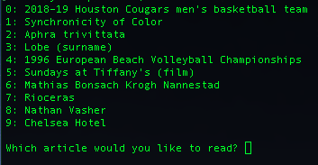
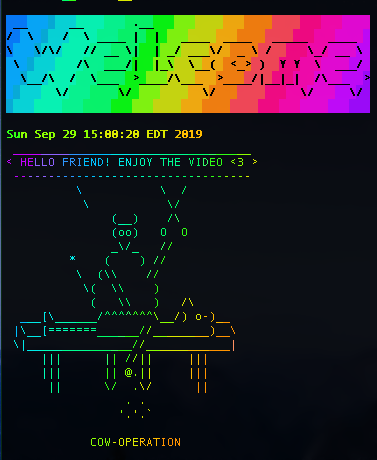

# shell-skriptz
## What is a shell script?
> "The real power of the computer is its ability to do the work for you. To get it to do that, we use the power of the shell to automate things. We write shell scripts." - [random site](http://linuxcommand.org/lc3_writing_shell_scripts.php)

## Setting up
As these are shell scripts, they're meant to be run in the shell (specifically a Unix shell). I'm using Bash on a Mac, so a few things may work differently for you (I'll remark on those differences if I can catch them). I don't think I have any 'bashims" in my scripts (i.e. features not defined by POSIX, which are specific to the Bash shell), so at least that shouldn't be an issue. *Update: I'm also using these on Arch Linux now, so they should work for you wherever you may be.*

To start, I suggest creating a directory titled `.scripts` in your home folder, noteably including the `.` prefix so to not visually clutter up your working space (I've learned from my mistakes). This is where you'll be keeping all of the shell scripts you write/save. 

Next, you'll need to add this directory to your PATH. Essentially this gives you the ability to refer to any files within the directory simply by their name, even when you're working in a different directory (e.g. writing `example` vs something like `~/.scripts/example`). To do this, edit your `.bash_profile` or `.profile`, which are located in your home directory, and insert this line:   `export PATH=$PATH:~/.scripts`. *Note: If you already have something similar, you can simply add* `:~/.scripts` *at the end of the line.*

The last step (once you have the scripts in the proper directory, of course), is to execute the command `chmod +x example`for each file, thus making them executable. And that should be it!

*** 

# Documentation

## Miscellaneous

### hmm
<pre> hmm </pre>
* This one simply clears the screen and then calls `ls` -- it's essentially a fidgeting command that I can call while I'm thinking about what to do next (hence the name). `hmm` is also shorter to write than `clear`, which saves me a few milliseconds :P. (*Note: ^L, aka CTRL L, clears the terminal screen as well, and can be used as an alternative to* `clear`)

### newcpp / newjava
<pre>newcpp hello
newcpp hello.cpp
newjava hello
newjava hello.java</pre>
  
* These scripts help bypass boilerplate code that wastes time and accelarates your impending carpal tunnel. Invoking the command opens your default editor/IDE with a new *.cpp/.java* file, already named and containing a few lines of code. The script checks whether you've included the extension for the file in your argument, so there's no need to write anything besides your desired file name. 
* (*Compatability note: these scripts use the* `open` *command, which is unique to MacOS -- it just uses the default program to open a file based on its extension. The Linux alternative to `open` is `xdg-open`. For other Unix systems, changing `open` to your desired text editor, e.g. `nano`, should do the trick.*). 

### run
<pre>run hello.cpp</pre>
* *(requires: [gcc/g++](https://gcc.gnu.org/))*

* Short and sweet -- this script compiles a *.cpp* file with `g++` (creating *a.out*) and runs the resulting out file.

### mp3
<pre>mp3 https://www.youtube.com/watch?v=dQw4w9WgXcQ</pre>
* *(requires: [youtube-dl](https://github.com/ytdl-org/youtube-dl))*

* I cannot recommend `youtube-dl` enough, both as an alternative to suspicious YouTube2MP3 websites, and to streaming services such as Spotify. Calling `mp3 <url>` downloads the requested file to your current directory. If you're using iTunes or a similar music player, you have to first open the file in the player manually in order for it to show up in your music library. For me, this process often looks like this: 
 1. Call `mp3 <url>` in my home directory (for as many songs as necessary)
 2. `open *.mp3` (at this point the songs will successfully be in iTunes)
 3. `mv *.mp3 ~/Downloads`(or to wherever you store your music files)
 4. Next time you play a song you moved, iTunes may or may not give you an error message claiming it cannot find the file (since you moved it to a new directory). Simply follow the prompts it gives you, locate the erroneous file in Finder, and the rest will be found automatically. This is, of course, a horrible solution, but the important thing is that you have the file readily accessible on your computer.
 5. Optionally, you can add points 2. and 3. to the script, but I prefer not to have iTunes open every time I download a file.
 
 *Suggestion: If you only need a snippit of some audio, rather than the entire file, download [Audio Hijack](https://rogueamoeba.com/audiohijack/), a great program with an indefinite free trial that allows you to record the audio directly from your computer.*
 
 *Suggestion #2: Play your music in style with my command-line music player, [teapot](https://github.com/joshnatis/teapot) :P*
 
 ### mp3crop
 <pre>mp3crop 1:00 2:08 https://youtu.be/DljBMflGdek</pre>

* *(requires: [youtube-dl](https://github.com/ytdl-org/youtube-dl))*

* This one is just like `mp3`, but with the added functionality of cropping a desired section of a YouTube video. The script would probably be better if it could be integrated into `mp3` and called like this: `mp3 --crop start-time end-time <url>`, if I have enough time and competency I'll implement that (or you can help me!).

### wiki
<pre> wiki     #Presents you with 10 random wikipedia articles to choose from</pre>
* *(requires: [Python](https://www.python.org/))*

* This script is actually written in Python, but since you can also do `chmod +x` on Python scripts (and even drop the .py), I figured it was still relavant to include here. To use, simply call `wiki` and then enter the index of the article you want to read (or -1 for 10 new articles) -- it'll be opened in your default web browser. The articles are fetched from [this Wikipedia API](https://en.wikipedia.org/w/api.php?action=query&list=random&rnnamespace=0&rnlimit=10&format=json).
* (*Compatability note: this script uses the `open` command to open the article in your default browser. If you're not on MacOS you can change that to `xdg-open` or to the name of your desired browser*)

### intro
<pre>intro     #Does colorful stuffs</pre>
* *(requires: [cowsay](https://en.wikipedia.org/wiki/Cowsay) and [lolcat](https://github.com/busyloop/lolcat))*

* This one's just for fun; it prints out some colorful things as well as a random ASCII art character using `cowsay`.

## Video-Related Scripts

### record
<pre>record                     #yields OUT.mp4
record --mov               #yields OUT.mov
record name                #yields name.mp4 
record --mov name          #yields name.mov (order doesn't matter)
</pre>
* *(requires: [ffmpeg](https://github.com/FFmpeg/FFmpeg))*

* Another indispensible tool in anyone's toolkit -- `ffmpeg`. If you've ever tried to record your screen on MacOS, then you've probably experieced the perils of QuickTime Player and *.mov*. Though I appreciate Apple providing a native screenrecorder, QuickTime is bulky, only works with files in *.mov* format (which happen to be huge and don't work well with YouTube), and is relatively featureless. Also, c'mon, having that QuickTime icon in your Dock while recording makes you look like an amateur! Lol. 

* With `record`, you can call the command whenever you're ready to start, and enter *q* or *^C* to finish recording. The resulting file will be titled *OUT.mp4*, or something similar if you provided some arguments. If you've accidentally messed up the video format, you can convert from *.mov* to *.mp4* (or vice versa) when finished by invoking this command: `ffmpeg -i input.mov output.mp4`.
* (*Compatability note: the arguments within this script strongly depend on your OS and even your specific setup -- make sure to visit [this](https://trac.ffmpeg.org/wiki/Capture/Desktop) site for info on how to properly configure for your system. I also provided a commented command that would work on Linux.*)
* *Note 2: Check the script for an equivalent command that works on Linux (it's commented out)*

### concatv
<pre>concatv                                   #concatenates all .mp4 files in directory
concatv vid1.mp4 vid2.mp4 vid3.mp4        #concatenates .mp4 files listed as arguments
</pre>
* *(requires: [ffmpeg](https://github.com/FFmpeg/FFmpeg))*

* If you ever have multiple video files which you'd like to stitch together into one video, this script is the one to use. Invoking it will result in a file called *final.mp4*. Be ware that the order in which you list your arguments matters (they will be concatenated in that order). *Note: only meant to work for .mp4 files, but can very easily be changed to support any filetype supported by `ffmpeg`. Note 2: Apparently the video files are required to be in the same aspect ratio and size in order for this to work. In order to not run into issues with this, just record your full screen or assure that the videos are the same size. Hopefully I can find a fix for this.* 

### delayaudiov
<pre>delayaudiov     #Asks for input video, seconds to delay by, and output file</pre>
* *(requires: [ffmpeg](https://github.com/FFmpeg/FFmpeg))*

* If your audio and video are somehow out of sync (which has been happening to me a lot recently), you can try to remedy that with this script. If you don't know exactly how far the video lags behind the audio, you can keep delaying the audio by 1 second at a time until you're satisfied.

### changevolumev
<pre> changevolumev     #Asks for input video, decibels to change audio by (+/-), and output file</pre>
* *(requires: [ffmpeg](https://github.com/FFmpeg/FFmpeg))*

* If your audio is either too quiet or too loud, you can adjust that with this script. Again, if you're unsure of exactly how much to raise/decrease the volume by, incrementally call this script with small changes until satisfied.

## RMarkdown-Related Scripts

**Preface**: RMarkdown is awesome. If you're taking notes in a WYSIWYG editor, stop it! RMarkdown is a markup language, meaning you use it to specify what you want a document to look like/contain (yep, just like HTML... except HTML sucks). You're also free to use arbitrary bits of LaTeX or HTML anywhere in your note, and with **pandoc** it easily outputs to PDF or HTML. Did I mention the notes also look beautiful? Oh, and you can run code within the notes... nice. I'm not gonna be able to give a comprehensive tutorial on setting up, so check [this](https://www.youtube.com/watch?v=4J5a0JWIF-0) out as a start.

### note

<pre>note coolname        #Creates a file named coolname.rmd in your notes directory with some prefilled information</pre>

* This just creates a new note, prefills some meta-data (such as the title, author name, date, and output file format). If you use this script change the following things: (1) the author name, (2) the directory your notes are created in. You might also want to change `vim` to your preferred editor (or to `$EDITOR`).

### render

<pre>render mynote.rmd        #Compiles .rmd file to specified (in meta-data) output file format</pre>

* Usually when people use RMarkdown they write it and compile it in RStudio. If you want to use something else, this is the command you can use to compile your note.
* *Note*: If you want a keyboard shortcut for this in **vim**, I got u. Just add the following to your `.vimrc` file, or wherever you keep your config:
`autocmd FileType rmd map ,2 :!echo<space>"require(rmarkdown);<space>render('<c-r>%')"<space>\|<space>R<space>--vanilla<enter>`

    - Now you can simply press `,2` and the .rmd file will compile (don't forget to save your changes beforehand).

## Utilities

**Preface**: Stuff is hard to set up sometimes. After installing Arch Linux a bunch of things were not working for me, so I had to cobble together imperfect but functional solutions (some are better than others, this backlight script is something from another planet).

### backlight
* This is referring to the computer screen brightness, by the way.
<pre>
su root           #This script requires you to be root in order to execute it :D
backlight up      #Raises the backlight by 80 (out of 852, so that's roughly 10 executions to go from off to on)
backlight down    #Lowers the backlight by 80
backlight on      #Maximizes brightness to 100%
backlight off     #Turns off screen completely (not recommended, as you'll have to turn it back on by typing without seeing anything lol)
backlight dim     #Lowers backlight to the dimmest possible brightness (but still visible).
</pre>

* For some reason I couldn't bind my function keys to actually change my brightness. Maybe you're in the same situation. This is a workaround.
)* 
*Note*: This will probably work in a similar way for you, but you might have to change `intel_backlight` to `acpi_video`, as well as change the numbers. Read [this](https://wiki.archlinux.org/index.php/Backlight) guide for more information.

### light
* This is referring to the keyboard backlight
<pre>
#You'll need to have sudoers access to use this
light 2   #I believe this is the maximum brightness value
light 1   #A nice medium
light 0   #No keyboard backlight
</pre>

* Again, if you can't seem to figure out any better solution you can use this. For more information, read [this](https://wiki.archlinux.org/index.php/Keyboard_backlight).

### usbguide
<pre> usbguide    #Prints out a nice guide for mounting and unmounting a USB using the terminal</pre>

* Ah, yes, another missing functionality. This script doesn't actually mount the USB for you, but rather prints out a little guide to help you do it by hand.

### screenshot
<pre>screenshot       #Saves screenshot in file named output.jpg</pre>
* *(requires: [ffmpeg](https://github.com/FFmpeg/FFmpeg))*

* If you don't have any utility to take screenshots for you, this is a cheap alternative (cheap as in lacking in dependencies, not as in $$$, cause this is obviously free lols). *"What if I don't want the terminal window to be in my screenshot?"* you say... well this takes a second to execute so you have just enough time to somehow hide the window (or you can bind the script to execute when you hit a certain key, which gives me a good idea...).

* *Note: make sure to change the screen size to the dimensions of your screen*
